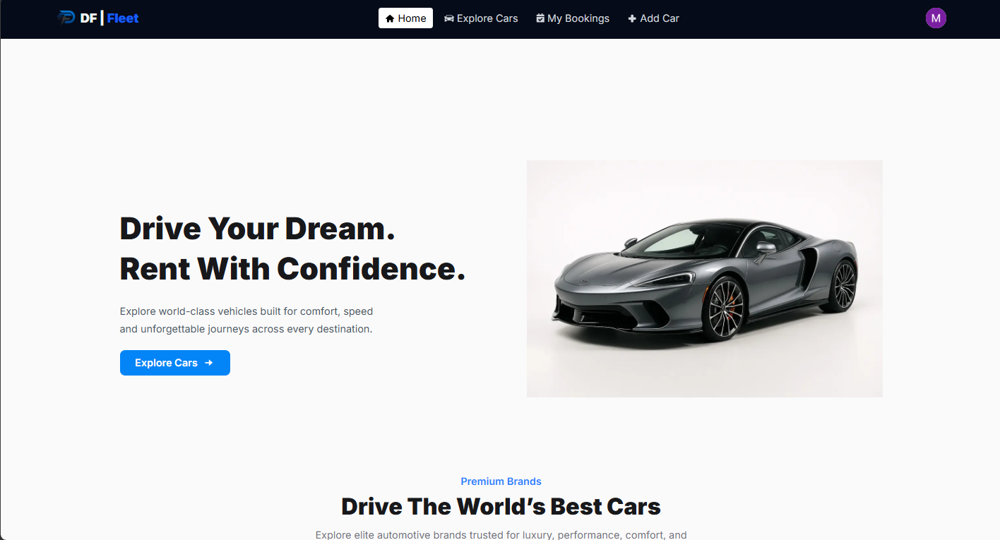

# Drive Fleet Car Rental Platform



Live site: https://drive-fleet-car-rental-platform.vercel.app

## Project overview

Drive Fleet is a car rental web application built with Next.js and React. It provides secure user authentication, searchable car listings, and a straightforward booking workflow so customers can find, book, and manage vehicles.

## Key features

- Responsive car search and listing with detailed car pages and images.
- Email/password and social (Google) authentication powered by `better-auth`.
- Add, edit and manage car listings from the user dashboard.
- Booking flow with token-based authorization and booking history.
- Server-side API routes for authentication and data operations (`src/app/api`).
- MongoDB-backed storage using `@better-auth/mongo-adapter`.
- Small, reusable React components and a mobile-friendly UI (Swiper carousel, toasts).

## Tech stack

- Next.js 16.2.6
- React 19.2.4
- MongoDB (`mongodb`)
- `better-auth` + `@better-auth/mongo-adapter`
- Tailwind CSS / PostCSS
- Deployed on Vercel

## Quick start (local)

Prerequisites: Node.js (recommended 18+) and `npm` or `yarn`.

1. Clone the repository and install dependencies:

```bash
git clone <repo-url>
cd drive-fleet-car-rental-platform
npm install
```

2. Create a `.env.local` file in the project root with the following variables (example):

```
MONGODB_URI=your_mongodb_connection_string
CLIENT_ID=your_google_oauth_client_id
CLIENT_SECRET=your_google_oauth_client_secret
NEXT_PUBLIC_BETTER_AUTH_URL=http://localhost:3000/api/auth
NEXT_PUBLIC_API_URL=http://localhost:3000/api
```

3. Run the development server:

```bash
npm run dev
# open http://localhost:3000
```

## Available scripts

- `npm run dev` — start development server
- `npm run build` — build for production
- `npm run start` — start production server after build
- `npm run lint` — run ESLint

## Environment variables (summary)

- `MONGODB_URI` — MongoDB connection string used in `src/lib/auth.js` (database: `driveFleetCarRental`).
- `CLIENT_ID`, `CLIENT_SECRET` — OAuth credentials for Google social login (configured in `src/lib/auth.js`).
- `NEXT_PUBLIC_BETTER_AUTH_URL` — Public base URL for the Better Auth client (`src/lib/auth-client.js`).
- `NEXT_PUBLIC_API_URL` — Base URL used by the app to call its own API (`src/app/lib/config.js`).

## Project structure (important files)

- `src/app` — Next.js app routes and pages (e.g., `add-car`, `explore-car`, `login`, `signup`, `my-booking`).
- `src/components` — Reusable UI components and shared layout.
- `src/lib` — Library utilities: `auth.js`, `auth-client.js`, `config.js`, data helpers.
- `src/app/api` — Server API routes (including `auth/[...all]/route.js`).
- `public` — Static assets (Banner.png).

## Authentication & data notes

- Authentication is implemented with `better-auth` and a MongoDB adapter. Session tokens use JWT plugin.
- The auth database name is `driveFleetCarRental` (see `src/lib/auth.js`).

## Deployment

- Live demo: https://drive-fleet-car-rental-platform.vercel.app
- For Vercel deployments, set the same environment variables in the Vercel dashboard.

## Contributing

- PRs and issues are welcome. Open an issue before submitting larger changes.

## License

- No license specified. Add a `LICENSE` file if you want to open-source this project under a specific license.
